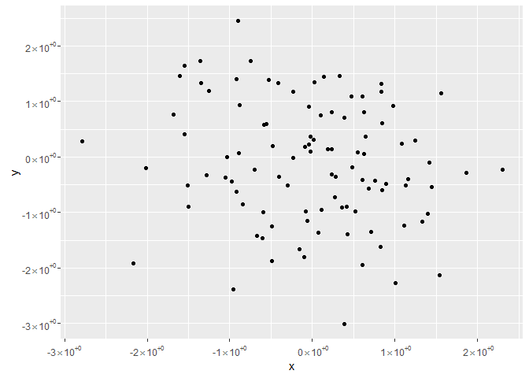

-   [ResearchGroupTools](#researchgrouptools)
    -   [Installation](#installation)
    -   [Usage](#usage)
-   [Functionality](#functionality)
    -   [Library handling](#library-handling)
    -   [Numerical functions](#numerical-functions)
    -   [Time series](#time-series)
    -   [Matrix functions (or data.frame)](#matrix-functions-or-data.frame)
    -   [Descriptive statistics](#descriptive-statistics)
    -   [Visualization](#visualization)
    -   [Package development](#package-development)

<!-- README.md is generated from README.Rmd. Please edit that file -->
ResearchGroupTools
==================

[](https://travis-ci.org/sfeuerriegel/ResearchGroupTools) [](https://cran.r-project.org/package=ResearchGroupTools) [](https://codecov.io/github/sfeuerriegel/ResearchGroupTools?branch=master)

**ResearchGroupTools** provides a collection of utilitiy function for rapid prototyping. These functions facilitate implemenation works related to advanced analytics. As such, it specifically supports data handling, preprocessing, visualization and analytics.

Installation
------------

Using the **devtools** package, you can easily install the latest development version of **SentimentAnalysis** with

``` r
install.packages("devtools")

# Option 1: download and install latest version from "GitHub"
devtools::install_github("sfeuerriegel/ResearchGroupTools")

# Option 2: install directly from bundled archive
# devtoos::install_local("ResearchGroupTools_0.1.0.tar.gz")
```

Notes:

-   In the case of option 2, you have to specify the path either to the directory of **ResearchGroupTools** or to the bundled archive **ResearchGroupTools\_0.1.0.tar.gz**

-   The package will only be shipped via GitHub; CRAN support is not intended.

Usage
-----

This section shows the basic functionality of how to perform a sentiment analysis. First, load the corresponding package **ResearchGroupTools**.

``` r
library(ResearchGroupTools)
```

By default, the seed for the random number generator is initialized to 0.

Functionality
=============

Library handling
----------------

-   `Library()` (note the capital "L") loads packages. If not available, these are automatically installed.

``` r
Library("ggplot2", "dplyr")
#> ggplot2
#> dplyr
```

Numerical functions
-------------------

-   `ceil()` computes the largest integer less or equal given a numerical value. It is a wrapper for `ceiling` with a more consistent naming.

``` r
ceil(3.4)
#> [1] 4
```

Time series
-----------

-   `differences()` calculates lagged differences of a given order. It is more convenient thant `diff()` as it adds leading `NA` values.

``` r
differences(1:10)
#>  [1] NA  1  1  1  1  1  1  1  1  1
differences(c(1, 2, 4, 8, 16, 32))
#> [1] NA  1  2  4  8 16
differences(c(1, 2, 4, 8, 16, 32), order = 2)
#> [1] NA NA  1  2  4  8
differences(c(1, 2, 4, 8, 16, 32), na_padding = FALSE)
#> [1]  1  2  4  8 16
```

-   `returns()` calculates returns of a time series (similar to `diff()` for differenes).

``` r
returns(1:10)
#>  [1]        NA 1.0000000 0.5000000 0.3333333 0.2500000 0.2000000 0.1666667
#>  [8] 0.1428571 0.1250000 0.1111111
returns(c(1, 2, 4, 8, 16, 32))
#> [1] NA  1  1  1  1  1
returns(c(1, 2, 4, 8, 16, 32), na_padding = FALSE) # remove trailing NA's
#> [1] 1 1 1 1 1
```

-   `logReturns()` computes log-returns (by default, with base `exp(1)`).

``` r
logReturns(c(1, 2, 4, 8, 16, 32), base = 2)
#> [1] NA  1  1  1  1  1
```

Matrix functions (or data.frame)
--------------------------------

-   `findRowsNA()` and `showRowsNA()`, as well as `findColsNA()` and `showColsNA()`, help find `NA` values within a dataset.

``` r
m <- matrix(letters[c(1, 2, NA, 3, NA, 4, 5, 6, 7, 8)], ncol = 2, byrow = FALSE)
colnames(m) <- c("x", "y")
m
#>      x   y  
#> [1,] "a" "d"
#> [2,] "b" "e"
#> [3,] NA  "f"
#> [4,] "c" "g"
#> [5,] NA  "h"

anyNA(m)      # use built-in routine to test for NA values
#> [1] TRUE

findRowsNA(m) # returns indices of that rows
#> [1] 3 5
showRowsNA(m) # prints rows with NA values
#>      x  y  
#> [1,] NA "f"
#> [2,] NA "h"

findColsNA(m) # returns name of that columns
#> [1] "x"
showColsNA(m) # print columns with NA values
#> [1] "a" "b" NA  "c" NA
```

Descriptive statistics
----------------------

-   `descriptiveStatistics()` produces **pretty** summary statistics. Afterwards, `export()` allows for direct export to a LaTeX file. In this case, an optional parameter `filename` can be used to change the filename for the export.

``` r
data(USArrests)
d <- descriptiveStatistics(USArrests)
d
#>             mean median  min   max     sd   skew kurtosis
#> Murder     7.788   7.25  0.8  17.4  4.356  0.371   -0.949
#> Assault  170.760 159.00 45.0 337.0 83.338  0.221   -1.145
#> UrbanPop  65.540  66.00 32.0  91.0 14.475 -0.213   -0.872
#> Rape      21.232  20.10  7.3  46.0  9.366  0.754    0.075
## export(d)
```

Visualization
-------------

-   `scientific_labels()` enables a nice exponential notation in **ggplot2** plots.

``` r
library(ggplot2)
df <- data.frame(x=rnorm(100), y=rnorm(100))
ggplot(df, aes(x=x, y=y)) +
  geom_point() +
  scale_x_continuous(labels=scientific_labels) +
  scale_y_continuous(labels=scientific_labels)
```



Package development
-------------------

-   `remakePackage()` builds, loads and checks package during the development process all at once. In particular, the manual is updated.

``` r
remakePackage()
remakePackage(TRUE) # also runs README.Rmd
```

### License

**ResearchGroupTools** is released under the [MIT License](https://opensource.org/licenses/MIT)

Copyright (c) 2016 Stefan Feuerriegel
