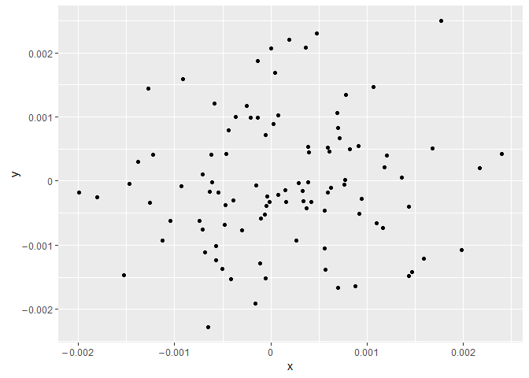
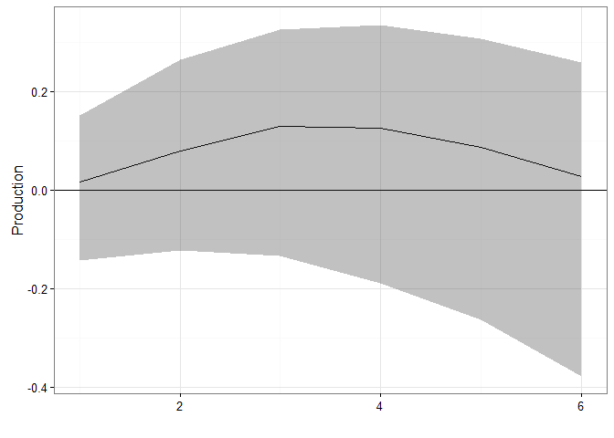

-   [ResearchGroupTools](#researchgrouptools)
    -   [Installation](#installation)
    -   [Usage](#usage)
-   [Functionality](#functionality)
    -   [Library handling](#library-handling)
    -   [Strings](#strings)
    -   [Numerical functions](#numerical-functions)
    -   [Data handling](#data-handling)
    -   [Time series](#time-series)
    -   [Matrix functions (or data.frame)](#matrix-functions-or-data.frame)
    -   [Descriptive statistics](#descriptive-statistics)
    -   [Visualization](#visualization)
    -   [Regressions](#regressions)
    -   [Time series analysis](#time-series-analysis)
    -   [Hooks to other packages](#hooks-to-other-packages)
    -   [Package development](#package-development)

<!-- README.md is generated from README.Rmd. Please edit that file -->
ResearchGroupTools
==================

[](https://travis-ci.org/sfeuerriegel/ResearchGroupTools) [](https://cran.r-project.org/package=ResearchGroupTools) [](https://codecov.io/github/sfeuerriegel/ResearchGroupTools?branch=master)

**ResearchGroupTools** provides a collection of utilitiy function for rapid prototyping. These functions facilitate implemenation works related to advanced analytics. As such, it specifically supports data handling, preprocessing, visualization and analytics.

Installation
------------

Using the **devtools** package, you can easily install the latest development version of **ResearchGroupTools** with

``` r
install.packages("devtools")

# Recommended option: download and install latest version from "GitHub"
devtools::install_github("sfeuerriegel/ResearchGroupTools", dependencies = TRUE)
```

Notes:

-   The package will only be shipped via GitHub; CRAN support is not intended due to several hooks.

Usage
-----

This section shows the basic functionality of how accelerate data science in R. First, load the corresponding package **ResearchGroupTools**.

``` r
library(ResearchGroupTools)
#> Warning: package 'texreg' was built under R version 3.3.1
#> Warning: changing locked binding for 'coeftostring' in 'texreg' whilst
#> loading 'ResearchGroupTools'
#> Warning: changing locked binding for 'sanitize.numbers' in 'xtable' whilst
#> loading 'ResearchGroupTools'
```

By default, the seed for the random number generator is initialized to 0.

Functionality
=============

Library handling
----------------

-   `Library()` (note the capital "L") loads packages. If not available, these are automatically installed.

``` r
Library("texreg")
#> texreg
```

-   `loadRegressionLibraries()` loads and installs common libraries for econometric purposes.

``` r
loadRegressionLibraries()
```

Strings
-------

-   `%+%` concatenates strings (as an alterantive to `paste()`).

``` r
"a" %+% "b"
#> [1] "ab"
3 %+% 4
#> [1] "34"
do.call(`%+%`, as.list(letters))
#> [1] "abcdefghijklmnopqrstuvwxyz"
```

Numerical functions
-------------------

-   `ceil()` computes the largest integer less or equal given a numerical value. It is a wrapper for `ceiling` with a more consistent naming.

``` r
ceil(3.4)
#> [1] 4
```

-   `cumskewness()`, `cumkurtosis()`, `cumsd()` (standard deviation) and `cumadev()` (average deviation) return a vector with cumulative results of the specific function.

``` r
library(dplyr)
#> Warning: package 'dplyr' was built under R version 3.3.1
#> 
#> Attaching package: 'dplyr'
#> The following objects are masked from 'package:stats':
#> 
#>     filter, lag
#> The following objects are masked from 'package:base':
#> 
#>     intersect, setdiff, setequal, union

df <- data_frame(x = 1:10, y = rnorm(10))
cumsd(df$x)
#>  [1]        NA 0.7071068 1.0000000 1.2909944 1.5811388 1.8708287 2.1602469
#>  [8] 2.4494897 2.7386128 3.0276504

df %>%
  mutate_all(funs("mean" = cummean, "sd" = cumsd))
#> # A tibble: 10 x 6
#>        x            y x_mean    y_mean      x_sd      y_sd
#>    <int>        <dbl>  <dbl>     <dbl>     <dbl>     <dbl>
#> 1      1  1.262954285    1.0 1.2629543        NA        NA
#> 2      2 -0.326233361    1.5 0.4683605 0.7071068 1.1237254
#> 3      3  1.329799263    2.0 0.7555067 1.0000000 0.9374104
#> 4      4  1.272429321    2.5 0.8847374 1.2909944 0.8078538
#> 5      5  0.414641434    3.0 0.7907182 1.5811388 0.7305264
#> 6      6 -1.539950042    3.5 0.4022735 1.8708287 1.1542404
#> 7      7 -0.928567035    4.0 0.2121534 2.1602469 1.1675809
#> 8      8 -0.294720447    4.5 0.1487942 2.4494897 1.0957240
#> 9      9 -0.005767173    5.0 0.1316207 2.7386128 1.0262500
#> 10    10  2.404653389    5.5 0.3589240 3.0276504 1.2053364
```

Data handling
-------------

-   `pull()`, `pull_string()` and `pull_ith()` extract single columns from a **dplyr** `tbl` object and return them as a vector.

``` r
d %>% pull(x)
#>  [1]  1  2  3  4  5  6  7  8  9 10
d %>% pull("x")
#>  [1]  1  2  3  4  5  6  7  8  9 10

v <- "x"
d %>% pull_string(v)
#>  [1]  1  2  3  4  5  6  7  8  9 10

d %>% pull_ith(1)
#>  [1]  1  2  3  4  5  6  7  8  9 10
```

-   `completeLowResolutionData()` takes data in low resolution (e.g. monthly) and copies its values to match a high resolution (e.g. daily).

``` r
ts <- data.frame(Date = seq(from = as.Date("2000-01-01"), to = as.Date("2000-03-31"), by = "1 day"))
df_monthly <- data.frame(Month = c(as.Date("2000-01-31"), as.Date("2000-02-29"), as.Date("2000-03-31")),
                         Values = 1:3)

df_daily <- completeLowResolutionData(ts$Date, df_monthly, "Month")

# example of how to bind things together
ts <- ts %>%
  left_join(df_daily, by = c("Date" = "Month"))
```

Time series
-----------

-   `lags()` computes several lags of a vector.

``` r
lags(1:5, c(1, 2, 3))
#>      [,1] [,2] [,3]
#> [1,]   NA   NA   NA
#> [2,]    1   NA   NA
#> [3,]    2    1   NA
#> [4,]    3    2    1
#> [5,]    4    3    2
lags(ts(1:5), c(1, 2, 5))
#> Time Series:
#> Start = 1 
#> End = 5 
#> Frequency = 1 
#>   structure(c(NA, 1L, 2L, 3L, 4L), .Tsp = c(1, 5, 1), class = "ts")
#> 1                                                                NA
#> 2                                                                 1
#> 3                                                                 2
#> 4                                                                 3
#> 5                                                                 4
#>   structure(c(NA, NA, 1L, 2L, 3L), .Tsp = c(1, 5, 1), class = "ts")
#> 1                                                                NA
#> 2                                                                NA
#> 3                                                                 1
#> 4                                                                 2
#> 5                                                                 3
#>   structure(c(NA_integer_, NA_integer_, NA_integer_, NA_integer_, 
#> 1                                                               NA
#> 2                                                               NA
#> 3                                                               NA
#> 4                                                               NA
#> 5                                                               NA
```

-   `differences()` calculates lagged differences of a given order. It is more convenient thant `diff()` as it adds leading `NA` values.

``` r
differences(1:10)
#>  [1] NA  1  1  1  1  1  1  1  1  1
differences(c(1, 2, 4, 8, 16, 32))
#> [1] NA  1  2  4  8 16
differences(c(1, 2, 4, 8, 16, 32), order = 2)
#> [1] NA NA  1  2  4  8
differences(c(1, 2, 4, 8, 16, 32), na_padding = FALSE)
#> [1]  1  2  4  8 16
```

-   `returns()` calculates returns of a time series (similar to `diff()` for differenes).

``` r
returns(1:10)
#>  [1]        NA 1.0000000 0.5000000 0.3333333 0.2500000 0.2000000 0.1666667
#>  [8] 0.1428571 0.1250000 0.1111111
returns(c(1, 2, 4, 8, 16, 32))
#> [1] NA  1  1  1  1  1
returns(c(1, 2, 4, 8, 16, 32), na_padding = FALSE) # remove trailing NA's
#> [1] 1 1 1 1 1
```

-   `logReturns()` computes log-returns (by default, with base `exp(1)`).

``` r
logReturns(c(1, 2, 4, 8, 16, 32), base = 2)
#> [1] NA  1  1  1  1  1
```

Matrix functions (or data.frame)
--------------------------------

-   `findRowsNA()` and `showRowsNA()`, as well as `findColsNA()` and `showColsNA()`, help find `NA` values within a dataset.

``` r
m <- matrix(letters[c(1, 2, NA, 3, NA, 4, 5, 6, 7, 8)], ncol = 2, byrow = FALSE)
colnames(m) <- c("x", "y")
m
#>      x   y  
#> [1,] "a" "d"
#> [2,] "b" "e"
#> [3,] NA  "f"
#> [4,] "c" "g"
#> [5,] NA  "h"

anyNA(m)      # use built-in routine to test for NA values
#> [1] TRUE

findRowsNA(m) # returns indices of that rows
#> [1] 3 5
showRowsNA(m) # prints rows with NA values
#>      x  y  
#> [1,] NA "f"
#> [2,] NA "h"

findColsNA(m) # returns name of that columns
#> [1] "x"
showColsNA(m) # print columns with NA values
#> [1] "a" "b" NA  "c" NA
```

-   `last_non_NA()` returns the last entry in a vector which is not `NA`. This is helpful when aggregating high resolution data (see example below).

``` r
last_non_NA(c(1, 2, 3, 4, NA))
#> [1] 4
 
values <- 1:100
values[sample(1:100, 10)] <- NA
df <- cbind(Year = c(rep(2000, 5), rep(2001, 5)),
              as.data.frame(matrix(values, nrow = 10)))

df %>%
  group_by(Year) %>%
  summarize_each(funs(last_non_NA)) %>%
  ungroup() %>%
  head()
#> # A tibble: 2 x 11
#>    Year    V1    V2    V3    V4    V5    V6    V7    V8    V9   V10
#>   <dbl> <int> <int> <int> <int> <int> <int> <int> <int> <int> <int>
#> 1  2000     5    15    25    35    45    55    65    74    85    95
#> 2  2001    10    20    30    40    50    60    70    80    90   100
```

Descriptive statistics
----------------------

-   `descriptiveStatistics()` produces **pretty** summary statistics. By default, it exports the statistics into a LaTeX file. An optional parameter `filename` can be used to change the filename for the export.

``` r
data(USArrests)
descriptiveStatistics(USArrests)
#> Column names: \textbf{Mean} & \textbf{Median} & \textbf{Min.} & \textbf{Max} & \textbf{Std. dev.} & \textbf{Skewness} & \textbf{Excess kurtosis} \\
#>             mean median  min   max     sd   skew excess_kurtosis
#> Murder     7.788   7.25  0.8  17.4  4.356  0.371          -0.949
#> Assault  170.760 159.00 45.0 337.0 83.338  0.221          -1.145
#> UrbanPop  65.540  66.00 32.0  91.0 14.475 -0.213          -0.872
#> Rape      21.232  20.10  7.3  46.0  9.366  0.754           0.075
unlink("table_descriptives.tex")
```

-   `correlationMatrix()` computes a **pretty** correlation matrix. An optional parameter `filename` can be used to specify a LaTeX file to which the result is exported with significance stars.

``` r
correlationMatrix(USArrests)
#>            Murder  Assault UrbanPop Rape
#> Murder                                  
#> Assault  0.802***                       
#> UrbanPop    0.070    0.259              
#> Rape     0.564*** 0.665***  0.411**
correlationMatrix(USArrests, filename = "table_cor.tex") # stores output in LaTeX file
#> Column names: \textbf{Murder} & \textbf{Assault} & \textbf{UrbanPop} & \textbf{Rape} \\
#>            Murder  Assault UrbanPop Rape
#> Murder                                  
#> Assault  0.802***                       
#> UrbanPop    0.070    0.259              
#> Rape     0.564*** 0.665***  0.411**
unlink("table_cor.tex")
```

This requires a few changes to your LaTeX document in order to get it running. The steps are documented in the help of ; below is a minimal working example:

``` r
\documentclass{article}
\usepackage{SIunitx}
  \newcommand{\sym}[1]{\rlap{$^{#1}$}}
  \siunitx{input-symbols={()*}}
\begin{document}

\begin{tabular}{l SSS}
\toprule
\include{table_cor}
\end{tabular}
\end{document}
```

Above, we included `SIunitx`, introduced a command `\sym`, changed the `input-symbols` and used custom column alignments (`S`).

Visualization
-------------

-   `linePlot()` is a simple wrapper to **ggplot2**.

``` r
linePlot(1:10)
```


``` r

x <- seq(0, 4, length.out = 100)
linePlot(x, sin(x))
```


-   `scientificLabels()` enables a nice exponential notation in **ggplot2** plots.

``` r
df <- data.frame(x=rnorm(100)/1000, y=rnorm(100)/1000)
ggplot(df, aes(x=x, y=y)) +
  geom_point() +
  scale_x_continuous(labels=scientificLabels) +
  scale_y_continuous(labels=scientificLabels)
```


-   `allDigitsLabels()` enforces that all digits are displayed in **ggplot2** plots.

``` r
ggplot(df, aes(x=x, y=y)) +
  geom_point() +
  scale_x_continuous(labels=allDigitsLabels) +
  scale_y_continuous(labels=allDigitsLabels)
```



Regressions
-----------

-   `makeFormula()` lets one build formulae based on strings to identify the individual variables.

``` r
makeFormula("y", "x")
#> y ~ x
makeFormula("y", c("x1", "x2", "x3"))
#> y ~ x1 + x2 + x3
makeFormula("y", c("x1", "x2", "x3"), "dummies")
#> y ~ x1 + x2 + x3 + dummies
```

-   `regression()` is a customized, all-in-one routine for ordinary least squares with optional dummy variables. It can filter for a subset of observations, remove outliers at a certain cutoff and remove dummies that are `NA`.

``` r
x <- 1:100
clusters <- rep(c(1, 2), 50)
dummies <- model.matrix(~ clusters)
y <- x + clusters + rnorm(100)
d <- data.frame(x = x, y = y)

m_dummies <- regression(formula("y ~ x + dummies"), data = d, subset = 1:90,
                        dummies = "dummies", cutoff = 0.5)
#> Removing 2 observations; i.e. 0.02222222 percent.
#> Dropping 1 coefficients: dummies(Intercept)
summary(m_dummies)
#> 
#> Call:
#> lm(formula = formula, data = data)
#> 
#> Residuals:
#>      Min       1Q   Median       3Q      Max 
#> -2.44887 -0.56382  0.04689  0.66382  1.91157 
#> 
#> Coefficients:
#>              Estimate Std. Error t value Pr(>|t|)    
#> (Intercept) -0.150553   0.360156  -0.418    0.677    
#> x            1.003736   0.003817 262.979  < 2e-16 ***
#> dummies      1.038393   0.198100   5.242 1.14e-06 ***
#> ---
#> Signif. codes:  0 '***' 0.001 '**' 0.01 '*' 0.05 '.' 0.1 ' ' 1
#> 
#> Residual standard error: 0.9289 on 85 degrees of freedom
#> Multiple R-squared:  0.9988, Adjusted R-squared:  0.9987 
#> F-statistic: 3.46e+04 on 2 and 85 DF,  p-value: < 2.2e-16
```

-   `showCoeftest()` shows coefficient tests, but hides (dummy) variables starting with a certain string.

``` r
x1 <- 1:100
x2 <- rep(c(1, 2), 50)
y <- x1 + x2 + rnorm(100)

m <- lm(y ~ x1 + x2)

showCoeftest(m, hide = "x") # leaves only the intercept
#>              Estimate Std..Error   t.value  Pr...t.. Stars
#> (Intercept) 0.1669856  0.3539642 0.4717586 0.6381586
```

-   `standardizeCoefficients()` extracts standardized coefficients and hides (dummy) variables if needed.

``` r
library(vars)
#> Warning: package 'vars' was built under R version 3.3.1
#> Loading required package: MASS
#> Warning: package 'MASS' was built under R version 3.3.1
#> 
#> Attaching package: 'MASS'
#> The following object is masked from 'package:dplyr':
#> 
#>     select
#> Loading required package: strucchange
#> Loading required package: zoo
#> 
#> Attaching package: 'zoo'
#> The following objects are masked from 'package:base':
#> 
#>     as.Date, as.Date.numeric
#> Loading required package: sandwich
#> Loading required package: urca
#> Warning: package 'urca' was built under R version 3.3.1
#> Loading required package: lmtest
data(Canada)

prod <- differences(as.numeric(Canada[, 2]))
production <- data.frame(Prod = prod, Lag1 = dplyr::lag(prod), Lag2 = dplyr::lag(prod, 2))

m <- lm(Prod ~ Lag1, data = production)
standardizeCoefficients(m)
#>           Coef  SdChange StandardizedCoef
#> Lag1 0.2969171 0.2143436        0.2968569
```

-   `extractRegressionStatistics()` extracts key statistics of regression and returns them as a `data.frame` (so that it can later be stacked via row-wise binding).

``` r
x <- 1:10
y <- 1 + x + rnorm(10)
m <- lm(y ~ x)
 
extractRegressionStatistics(m)
#>   Observations DegreesFreedom ResidualError  Rsquared AdjRsquared      AIC
#> 1           10              8      1.209819 0.8762685    0.860802 35.95675
#>       BIC Fstatistic Fsignficance Fstars
#> 1 36.8645   56.65612 6.752956e-05    ***
```

-   `getRowsOutlierRemoval()` helps to remove outliers at the 0.5% level at both ends (or any other threshold defined by the argument `cutoff`).

``` r
 d <- data.frame(x = 1:200, y = 1:200 + rnorm(200))
m <- lm(y ~ x, d)                  # fit original model

idx_rm <- getRowsOutlierRemoval(m) # identify row indices of outliers
m <- lm(y ~ x, d[-idx_rm, ])       # refit model with outliers removed
```

-   `texreg_tvalues()` converts a the result of an ordinary least squares regression into in LaTeX. Instead of reporting standard errors, it gives t-values as a common alternative in finance. An optional parameter `dummies` can be specified which removes certain coefficients in the output.

``` r
texreg_tvalues(m_dummies)
#> 
#> \begin{table}
#> \begin{center}
#> \begin{tabular}{l c }
#> \hline
#>  & Model 1 \\
#> \hline
#> (Intercept) & $-0.15$      \\
#>             & $(-0.42)$    \\
#> x           & $1.00^{***}$ \\
#>             & $(262.98)$   \\
#> dummies     & $1.04^{***}$ \\
#>             & $(5.24)$     \\
#> \hline
#> R$^2$       & 1.00         \\
#> Adj. R$^2$  & 1.00         \\
#> Num. obs.   & 88           \\
#> RMSE        & 0.93         \\
#> \hline
#> \multicolumn{2}{l}{\scriptsize{$^{***}p<0.001$, $^{**}p<0.01$, $^*p<0.05$}}
#> \end{tabular}
#> \caption{Statistical models}
#> \label{table:coefficients}
#> \end{center}
#> \end{table}
texreg_tvalues(m_dummies, hide = "dummies")
#> 
#> \begin{table}
#> \begin{center}
#> \begin{tabular}{l c }
#> \hline
#>  & Model 1 \\
#> \hline
#> (Intercept) & $-0.15$      \\
#>             & $(0.36)$     \\
#> x           & $1.00^{***}$ \\
#>             & $(0.00)$     \\
#> dummies     & $1.04^{***}$ \\
#>             & $(0.20)$     \\
#> \hline
#> R$^2$       & 1.00         \\
#> Adj. R$^2$  & 1.00         \\
#> Num. obs.   & 88           \\
#> RMSE        & 0.93         \\
#> \hline
#> \multicolumn{2}{l}{\scriptsize{$^{***}p<0.001$, $^{**}p<0.01$, $^*p<0.05$}}
#> \end{tabular}
#> \caption{Statistical models}
#> \label{table:coefficients}
#> \end{center}
#> \end{table}
```

Time series analysis
--------------------

-   `standardizeCoefficients()` returns standardized coefficients.

``` r
var.2c <- VAR(Canada, p = 2, type = "none")

standardizeCoefficients(var.2c$varresult$e)
#>                Coef   SdChange StandardizedCoef
#> e.l1     1.62046761 14.4485612       1.60957876
#> prod.l1  0.17973134  0.7418013       0.08263712
#> rw.l1   -0.04425592 -0.9971380      -0.11108180
#> U.l1     0.11310425  0.1799192       0.02004311
#> e.l2    -0.64815156 -5.7426482      -0.63973460
#> prod.l2 -0.11683270 -0.4640806      -0.05169887
#> rw.l2    0.04475537  1.0337409       0.11515939
#> U.l2    -0.06581206 -0.1040299      -0.01158900

std <- standardizeCoefficients(var.2c)
std$e
#>                Coef   SdChange StandardizedCoef
#> e.l1     1.62046761 14.4485612       1.60957876
#> prod.l1  0.17973134  0.7418013       0.08263712
#> rw.l1   -0.04425592 -0.9971380      -0.11108180
#> U.l1     0.11310425  0.1799192       0.02004311
#> e.l2    -0.64815156 -5.7426482      -0.63973460
#> prod.l2 -0.11683270 -0.4640806      -0.05169887
#> rw.l2    0.04475537  1.0337409       0.11515939
#> U.l2    -0.06581206 -0.1040299      -0.01158900
```

-   `adf()` checks a time series for stationarity using the Augmented Dickey-Fuller (ADF) test. It returns the result in a pretty format and, if an optional argument `filename` is specified, it also exports it as LaTeX.

``` r
adf(USArrests, verbose = FALSE)
#> The following time series appear stationary, as P-values > 0.05:  Murder, Assault, UrbanPop, Rape
#>   Variable Type Lags   TestStat CriticalValue10 CriticalValue5
#> 1   Murder none    1 -1.7630314           -1.61          -1.95
#> 2  Assault none    1 -1.5869393           -1.61          -1.95
#> 3 UrbanPop none    1 -0.4833016           -1.61          -1.95
#> 4     Rape none    1 -1.7395692           -1.61          -1.95
#>   CriticalValue1     Pvalue
#> 1          -2.62 0.07789519
#> 2          -2.62 0.11252638
#> 3          -2.62 0.62888163
#> 4          -2.62 0.08193470
adf(USArrests, vars = c("Murder", "Rape"), type = "drift",
   filename = "adf.tex", verbose = FALSE)
#> 
#> 
#> \begin{tabular}{ll SSSSS} 
#> \toprule 
#> \multicolumn{1}{l}{Variable} & \multicolumn{1}{l}{Deterministic trend} & \multicolumn{1}{c}{Lags}& \multicolumn{1}{c}{Test value} & \multicolumn{3}{c}{\textbf{Critical values}}\\ 
#> \cline{5-7} 
#> &&&& $10\,\%$ & $5\,\%$ & $1\,\%$ \\ 
#> 
#> 
#> All time series appear stationary, since all P-values < 0.05.
#>   Variable     Type Lags  TestStat CriticalValue10 CriticalValue5
#> 1   Murder Constant    1 -5.653178            -2.6          -2.93
#> 2     Rape Constant    1 -4.762830            -2.6          -2.93
#>   CriticalValue1       Pvalue
#> 1          -3.58 1.575081e-08
#> 2          -3.58 1.908966e-06
unlink("adf.tex")
```

-   `exportAdfDifferences()` allows to export an ADF test in levels and in differences in a combined table.

``` r
adf_levels <- adf(USArrests)
#> 1
#> Length  Class   Mode 
#>      1  ur.df     S4 
#> 2
#> Length  Class   Mode 
#>      1  ur.df     S4 
#> 3
#> Length  Class   Mode 
#>      1  ur.df     S4 
#> 4
#> Length  Class   Mode 
#>      1  ur.df     S4 
#> The following time series appear stationary, as P-values > 0.05:  Murder, Assault, UrbanPop, Rape
adf_diff1 <- adf(data.frame(Murder = diff(USArrests$Murder),
                            Assault = diff(USArrests$Assault),
                            UrbanPop = diff(USArrests$UrbanPop),
                            Rape = diff(USArrests$Rape)))
#> 1
#> Length  Class   Mode 
#>      1  ur.df     S4 
#> 2
#> Length  Class   Mode 
#>      1  ur.df     S4 
#> 3
#> Length  Class   Mode 
#>      1  ur.df     S4 
#> 4
#> Length  Class   Mode 
#>      1  ur.df     S4 
#> All time series appear stationary, since all P-values < 0.05.
exportAdfDifferences(adf_levels, adf_diff1)
#> 
#> 
#> \begin{tabular}{ll SSSSS} 
#> \toprule 
#> \multicolumn{1}{l}{Variable} & \multicolumn{1}{l}{Deterministic trend} & \multicolumn{1}{c}{Lags}& \multicolumn{1}{c}{Test value} & \multicolumn{3}{c}{\textbf{Critical values}}\\ 
#> \cline{5-7} 
#> &&&& $10\,\%$ & $5\,\%$ & $1\,\%$ \\ 
#> 
#> 
#>   tmp$Variable tmp$Type Lags TestStat CriticalValue10 CriticalValue5
#> 1       Murder     none    1   -1.763           -1.61          -1.95
#> 5      Assault     none    1   -8.020           -1.61          -1.95
#> 2     UrbanPop     none    1   -1.587           -1.61          -1.95
#> 6         Rape     none    1   -8.360           -1.61          -1.95
#> 3       Murder     none    1   -0.483           -1.61          -1.95
#> 7      Assault     none    1   -8.389           -1.61          -1.95
#> 4     UrbanPop     none    1   -1.740           -1.61          -1.95
#> 8         Rape     none    1  -10.775           -1.61          -1.95
#>   CriticalValue1
#> 1          -2.62
#> 5          -2.62
#> 2          -2.62
#> 6          -2.62
#> 3          -2.62
#> 7          -2.62
#> 4          -2.62
#> 8          -2.62
#>   tmp$Variable tmp$Type Lags TestStat CriticalValue10 CriticalValue5
#> 1       Murder     none    1   -1.763           -1.61          -1.95
#> 5      Assault     none    1   -8.020           -1.61          -1.95
#> 2     UrbanPop     none    1   -1.587           -1.61          -1.95
#> 6         Rape     none    1   -8.360           -1.61          -1.95
#> 3       Murder     none    1   -0.483           -1.61          -1.95
#> 7      Assault     none    1   -8.389           -1.61          -1.95
#> 4     UrbanPop     none    1   -1.740           -1.61          -1.95
#> 8         Rape     none    1  -10.775           -1.61          -1.95
#>   CriticalValue1
#> 1          -2.62
#> 5          -2.62
#> 2          -2.62
#> 6          -2.62
#> 3          -2.62
#> 7          -2.62
#> 4          -2.62
#> 8          -2.62
unlink("adf.tex")
```

-   `cointegrationTable()` performs a cointegration test following the Johansen procedure. The output is written as LaTeX into a file named `filename`.

``` r
cointegrationTable(USArrests, vars = c("Murder", "Rape"), K = 2, filename = "cointegration_eigen.tex")
#> Test statistic in the top row is larger than the 1% values:  All time-series variables are stationary, i.e. I(0), to start with. Cointegration is not relevant here. 
#> 
#> 
#> \begin{tabular}{l SSSS} 
#> \toprule 
#> \textbf{$H_{0}$} 
#> & \textbf{Test statistic} & \multicolumn{3}{c}{\textbf{Critical Values}}\\ 
#> \crule{3-5} 
#> & {$n = 2$}& {$10\,\%$} & {$5\,\%$} & {$1\,\%$} \\
#>     H0 TestStatistic CriticalValue10 CriticalValue5 CriticalValue1
#> 1  r=0         28.63           12.91           14.9          19.19
#> 2 r<=1        21.702             6.5           8.18          11.65
unlink("cointegration_eigen.tex")
```

-   `plotIrf()` returns a `ggplot` with a nice impulse response function in black/white.

``` r
plotIrf(irf, ylab = "Production")
```


-   `impulseResponsePlot()` combines computation and plot, thereby returning a `ggplot` with a nice impulse response function in black/white. If the optional argument `filename` is specified, the plot is automatically saved on the disk.

``` r
impulseResponsePlot(var.2c, impulse = "e", response = "prod", ylab = "Production", n.ahead = 5, filename = "irf_e_prod.pdf")
#> Saving 7 x 5 in image
```



``` r
unlink("irf_e_prod.pdf")
```

-   `testSpecification()` checks if non-autocorrelation, normally distributed residuals and homoskedasticity is present.

``` r
testSpecification(var.2c)
#> All specification tests seem fine. No autocorrelation, normally distributed residuals, homoskedasticity.
#>                           BG                PT               JB
#> Statistic   97.8554991662177  193.690038336454 4.37397926053634
#> Pvalue    0.0853032132233613 0.753481554600346 0.82190467653541
#> Stars                                                          
#>                        MARCH
#> Statistic   541.888980939688
#> Pvalue    0.0950466601495369
#> Stars
```

Hooks to other packages
-----------------------

-   `coeftostring()` from the `texreg` package is overwritten. This also fixes the behavior of `texreg()` itself.

``` r
coeftostring(-0.000001, digits = 4) # the original function would return "-.0000"
#> [1] ".0000"

d <- data.frame(y = 1:1000 - 0.0000001, x = 1:1000)
m <- lm(y ~ x, data = d)
texreg(m) # intercept would otherwise be "-0.00"
#> Warning in summary.lm(model, ...): essentially perfect fit: summary may be
#> unreliable
#> 
#> \begin{table}
#> \begin{center}
#> \begin{tabular}{l c }
#> \hline
#>  & Model 1 \\
#> \hline
#> (Intercept) & $0.00^{***}$ \\
#>             & $(0.00)$     \\
#> x           & $1.00^{***}$ \\
#>             & $(0.00)$     \\
#> \hline
#> R$^2$       & 1.00         \\
#> Adj. R$^2$  & 1.00         \\
#> Num. obs.   & 1000         \\
#> RMSE        & 0.00         \\
#> \hline
#> \multicolumn{2}{l}{\scriptsize{$^{***}p<0.001$, $^{**}p<0.01$, $^*p<0.05$}}
#> \end{tabular}
#> \caption{Statistical models}
#> \label{table:coefficients}
#> \end{center}
#> \end{table}
```

-   `sanitize.numbers()` inside `xtable` is overwritten.

``` r
xtable(matrix(1:4, nrow = 2) * -0.000001) # would otherwise return "-0.00"
#> % latex table generated in R 3.3.0 by xtable 1.8-2 package
#> % Tue Oct 18 23:35:19 2016
#> \begin{table}[ht]
#> \centering
#> \begin{tabular}{rrr}
#>   \hline
#>  & 1 & 2 \\ 
#>   \hline
#> 1 & 0.00 & 0.00 \\ 
#>   2 & 0.00 & 0.00 \\ 
#>    \hline
#> \end{tabular}
#> \end{table}
```

Package development
-------------------

-   `rebuildPackage()` builds, loads and checks package during the development process all at once. In particular, the manual is updated.

``` r
rebuildPackage()
rebuildPackage(TRUE) # also runs README.Rmd
```

### License

**ResearchGroupTools** is released under the [MIT License](https://opensource.org/licenses/MIT)

Copyright (c) 2016 Stefan Feuerriegel
